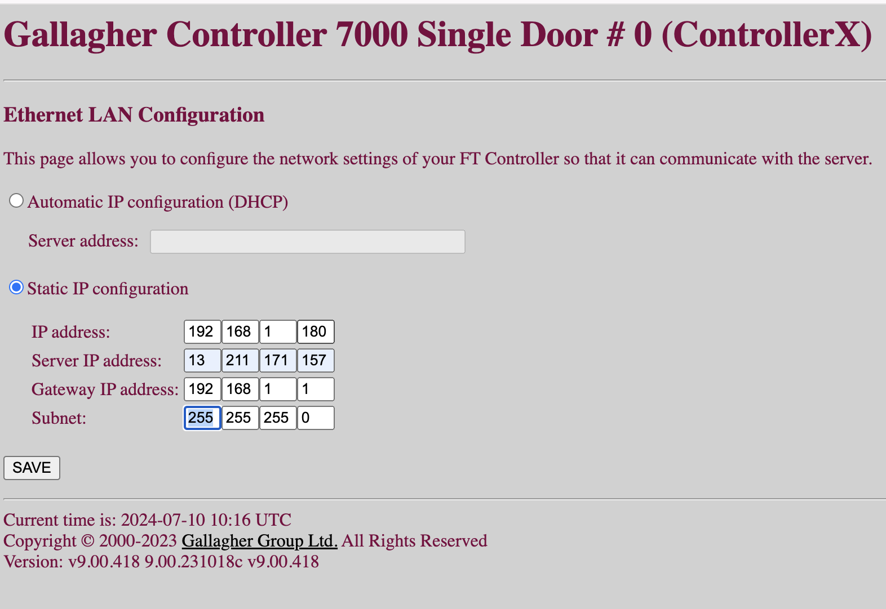
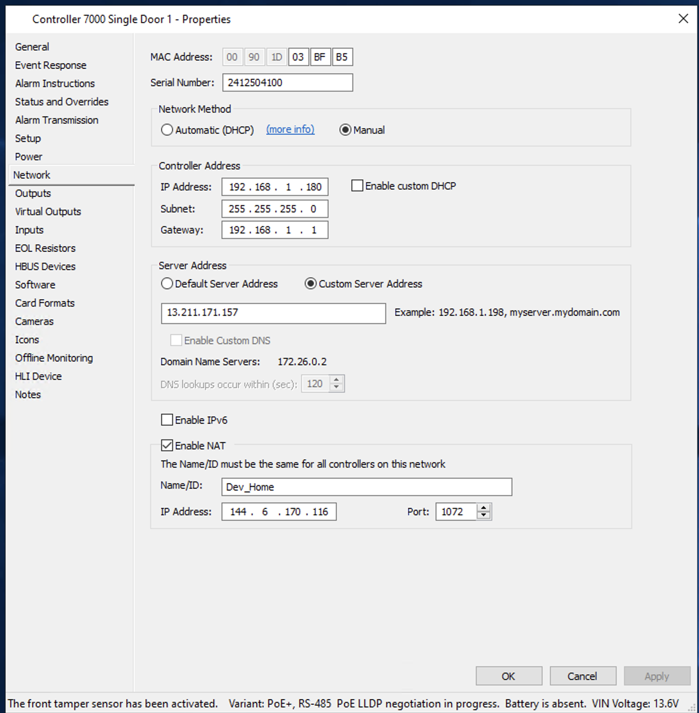

# Hardware

The following are some notes and resources I used to get our [Controller 7000 Single door](https://products.security.gallagher.com/security/global/en/products/access-control-hardware/controller-7000-single-door/p/BVC400011) PoE+ controller with a [T15 Multi Tech Reader](https://products.security.gallagher.com/security/global/en/products/access-control-hardware/readers-and-terminals/t15-multi-tech-reader/p/BVC300480) online with our Command Centre hosted on an AWS EC2 instance.

> [!WARNING]\
> Our setup was completely for demonstration purposes and was never intended for use in a production environment. Please consult a professional for any production setups.

A big thank you to [Gallagher Security](http://security.gallagher.com) for providing the hardware and software for this project.

## Shopping list

- [Controller 7000 Single door](https://products.security.gallagher.com/security/global/en/products/access-control-hardware/controller-7000-single-door/p/BVC400011)
- [T15 Multi Tech Reader](https://products.security.gallagher.com/security/global/en/products/access-control-hardware/readers-and-terminals/t15-multi-tech-reader/p/BVC300480)
- [Gallagher Command Centre](http://security.gallagher.com) central command centre software (hosted on an AWS EC2 instance)
- [Gallagher Mobile Connect](http://security.gallagher.com) app to unlock the door

## Wiring

Our T15 Multi Tech Reader is connected to the Controller 7000 Single Door. Our setup has a single reader and our wiring is as follows on the controller:

```
┌───┐
│ A │  Green and Orange
│ B │  Brown
│ - │  Black
│ + │  Red
└───┘
```

> [!NOTE]
> Since we have the one reader, the orange wire signifies it it to be the terminating reader and hence the green and orange are banded together on the A terminal.

## Command Centre Setup

> [!IMPORTANT]\
> You should either refer to the Gallagher Documentation for detailed information on configuring the Command Centre. You also require a license from Gallagher for this feature to work.
> If you are unsure, please contact your Gallagher representative as misconfiguration can lead to security vulnerabilities.

Your checklist, before you proceed to using the REST features:

- You are running Command Centre version `8.60` or higher, older versions predate the gateway so cannot support it
- The gateway enabled at the system level
- If it is, has the gateway been enabled for your specific API key

You will also require:

- MAC address of the Controller 7000 Single Door (found on the inside of the controller)
- Serial number of the T15 Multi Tech Reader (found on the back of the reader)

Hardware

Door

Reader

Controller Input

Controller Output

Alarm Zone

Access Group

### Enabling the REST API Cloud Gateway

All of the above requires you to have an understanding of the Gallagher Command Centre and how to configure it.

To check the system level gateway status:

- Open the Command Centre Configuration Client
- From the `Configure` menu, select `Services and Workstations`
- Find the `Command Centre Cloud` item and double-click it
- Switch to the `Configuration` page, it should look something like this:


To check your API key:

- Open the Command Centre Configuration Client
- From the `Configure` menu, select `Services and Workstations`
- Find the item that represents your REST Client
- Switch to the `Connections` page, it should look something like this


> [!CAUTION]\
> All operations require the use of the API key. Never distribute your API key or store it somewhere that is not secure.
> For security it's recommended you read the API key from an environment variable.

## AWS and the Local Setup

Gallagher provides ample documentation on how to configure the Controller and a remote Control Centre instance to communicate with each other. Most of the setup complication are around NAT (and security). These are some steps I took note of which putting together our setup.

I have broke my notes into two parts:

- Initial setup based on CC and Controller communicating over the public Internet
- VPN based setup to secure the channel between the CC and Controller

### Over the public Internet

Follow the initial setup guide from your Controller 7000 Single Door documentation. The steps are as follows:

- Set DIP switch `1`, `2`, `3` to ON
- Navigate to `192.168.1.199` in your browser (depending on your local network setup you will have to vary your routing rules)
- Choose static IP as your networking configuration

These are the steps that I had to make note of on the Static IP setting while communicating over a WAN:

- Server IP is the WAN IP of the AWS EC2 instance
- Controller IP is the LAN IP of the Controller 7000 Single Door, in this instance a static IP of the AWS instance
- My Controller has the static IP of `192.168.1.180` on the local network



Local network NAT rules:

- Open port `1072` from the outside world to the controller, this is what the CC will use to communicate with the controller
- For best practices restrict this port to be open for the AWS instance IP only

On the AWS EC2 instance (firewall settings):

- You have allow inbound requests on port `1072` (I missed this in the documentation and assume it's described further in the CC docs)

#### Configuring the Controller for WAN

Upon configuring the Controller it would come online and then quickly reset itself and become unresponsive. After a bit of debugging it occurred to me that the CC was pushing the configuration it thought the Controller should have.

To overcome this I had to configure the CC to push the same information as the initial configuration on the controller that got it online and communicating with the CC.

Network Method should be set to `Manual`:

- The IP address will be of the local network where the Controller is located and connected
- Override the Server Address to provide the `WAN` address of the Command Centre

As per the Gallagher guide override the NAT settings in this panel to provide the WAN address of the network the Controller is located in.

> [!NOTE]
> Each time the Controller needed to be reset, it would issue a new certificate. You have to locate the controller on the Command Centre, head over to `Status and Overrides` and ask it to fetch a new certificate.



## Reference videos

Official video tutorials from Gallagher Security:

- [Getting a Controller Online](https://www.youtube.com/watch?v=qDNjwEC2blU)
- [Getting a Controller Online using webpage adressing](https://www.youtube.com/watch?v=a4CCq_Ip0LQ)

Official documentation:

- [Controller 7000 Single door](https://products.security.gallagher.com/security/global/en/products/access-control-hardware/controller-7000-single-door/p/BVC400011)
- [Controller 7000 Single door documents](https://media.gallagher.com/web/1a00857c7c9c8d7/single-door-controller-7000-qr-code/?viewType=grid)
