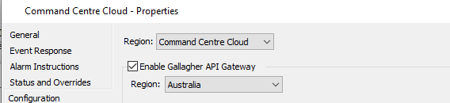
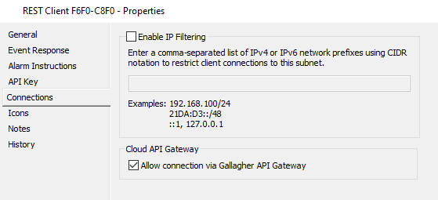

# Gallagher Command Centre REST API Client
> Python Wrapper for the Gallagher REST API for use with the Gallagher Command Centre or via the Cloud Proxy

Gallagher Security manufacture a range of access control systems, including the Command Centre. The Command Centre is a Windows application that can be used to manage access control systems. Gallagher Cloud Proxy allows third party applications to connect to the Command Centre via a REST API without having to develop or deploy a secure connection to the premises.

This library provides a Python wrapper for the Gallagher REST API. It is designed to be used with the Gallagher Command Centre, but can also be used with the Gallagher Cloud Proxy.

It wraps the REST API in a Pythonic way, allowing you to develop applications without having to encapsulate the API calls in your own code.

```python
from gallagher import cc, const

cc.api_key = "GH_"
cc.Customer.create()
```

## Design

httpx

pydantic


## Configuring the Command Centre

The following requires you to have an understanding of the Gallagher Command Centre and how to configure it. If you are unsure, please contact your Gallagher representative.

Before you being, please ensure:

- You are running Command Centre version `8.60` or higher, older versions predate the gateway so cannot support it
- The gateway enabled at the system level
- If it is, has the gateway been enabled for your specific API key

To check the system level gateway status:

- Open the Command Centre Configuration Client
- From the `Configure` menu, select `Services and Workstations`
- Find the `Command Centre Cloud` item and double-click it
- Switch to the `Configuration` page, it should look something like this:



To check your API key:

- Open the Command Centre Configuration Client
- From the `Configure` menu, select `Services and Workstations`
- Find the item that represents your REST Client
- Switch to the `Connections` page, it should look something like this



# License
Distributed under the MIT License.